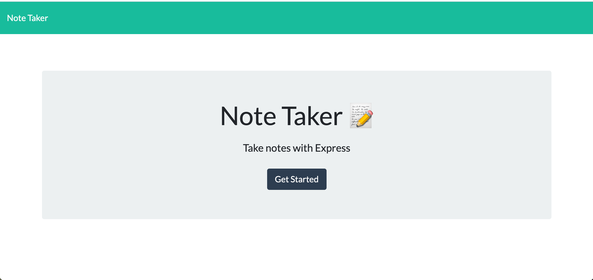
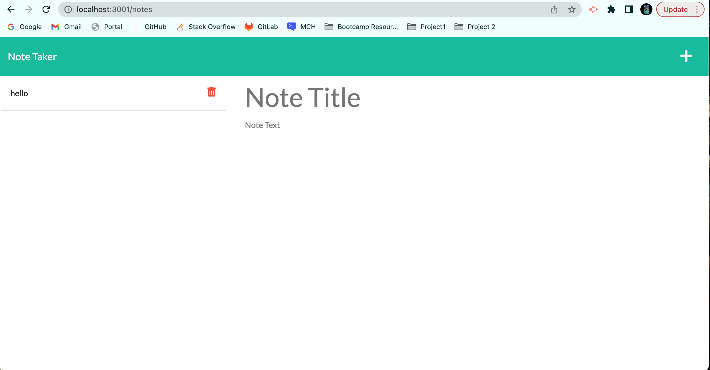
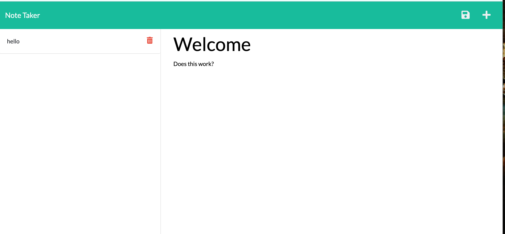
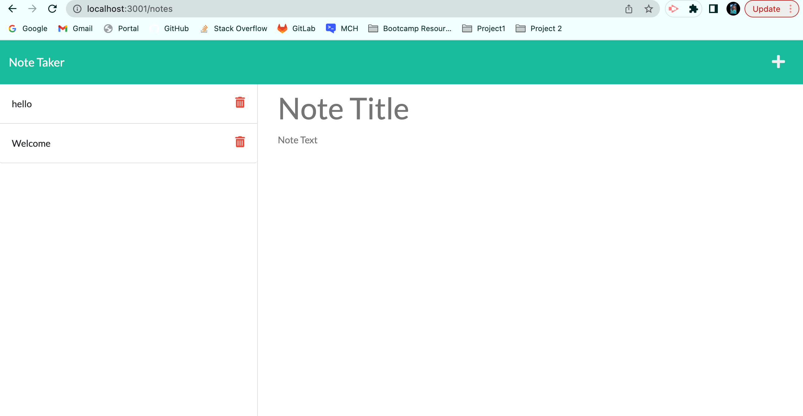

# Note Taker 
## Description
  
 A note taking app that allows user to enter notes and save them.  Notes can also be deleted .

  ## Table of Contents
  - [Description](#description)
  - [Installation](#installation)
  - [Usage](#usage)
  - [Contributors](#contributors)
  - [License](#license)
  - [Test](#tests)
  - [Questions](#questions)
  - [Video](#video)

  ## Installation
  Download and clone repository. 
  Run npm i to install express
  Run node server and open the app.

  ## Usage

    To add a new note, please enter title and add to body of note then click on save icon to save.

    You can click on trash can icon to delete note or click on plus sign to add another note.
  
  ## Contributors

  Latoya Lyew

  ## License
  

 

  ## Questions

  If you should have any questions about project, please visit github at [https:/github.com/lflyew](https://github.com/lflyew/) or email me at lflyew@gmail.com

  ## Repository Link

 https://github.com/lflyew/note_taker1

  ## Video

 https://drive.google.com/file/d/1Um7H1Cy13x0i_A74R_-H9jkpxb7obPSn/view?usp=share_link

  ## Screenshot

  
  
  
  

  
